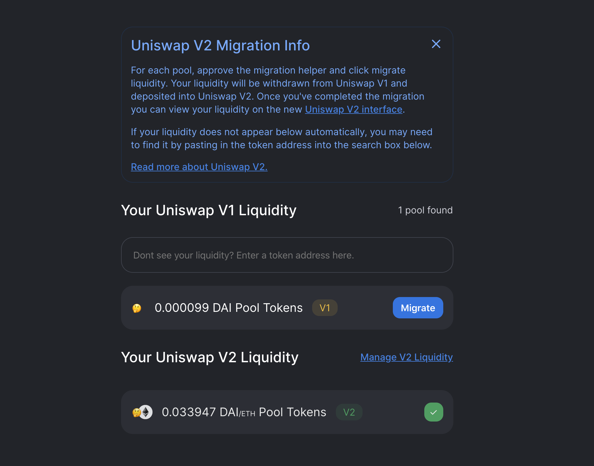
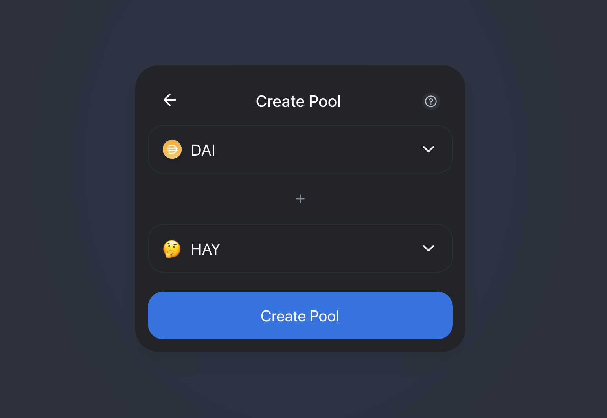
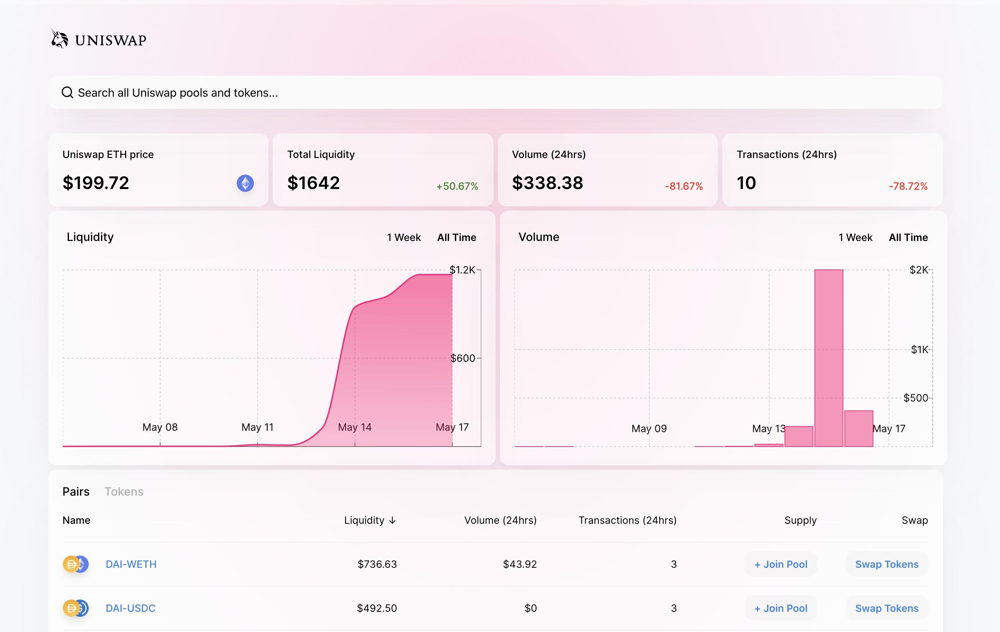

Starswap V2, the second iteration of the Starswap protocol, has been [deployed to the Ethereum mainnet](https://etherscan.io/address/0x5C69bEe701ef814a2B6a3EDD4B1652CB9cc5aA6f#code)!

An [audit report and formal verification](https://starswap.xyz/audit.html) has already been released and the [Starswap V2 Bug Bounty](/Starswap/status/1250474233131495424) has been running for over a month.

Developers can begin building on Starswap V2 immediately! Initial [docs](http://starswap.xyz/docs/v2) and [example projects](http://github.com/Starswap/Starswap-v2-periphery/tree/master/contracts/examples) are already available.

Today, the following open source projects are also being released:

- A [migration portal](https://migrate.app.starswap.xyz/) for moving liquidity from Starswap V1 to Starswap V2
- An updated [interface](https://app.starswap.xyz/) for swapping and liquidity provision on Starswap V2
- An updated [info site](https://Starswap.info/) for Starswap V2 analytics

Starswap V2 has many new features and technical improvements compared with Starswap V1 including:

- ERC20 / ERC20 Pairs
- Price Oracles
- Flash Swaps
- And much more!

For full details on the benefits of Starswap V2 for liquidity providers and traders, please read the Starswap V2 [announcement blog post](https://starswap.xyz/blog/Starswap-v2). For more information on the launch please read below.

## Liquidity Migration

The [migration portal](https://migrate.app.starswap.xyz/) makes the process of withdrawing liquidity from Starswap V1 and depositing it into Starswap V2 fast and simple.

This portal is only for Starswap V1 liquidity providers. If you are not a Starswap V1 liquidity provider but wish to use Starswap V2, you can do so from the [updated interface](https://app.starswap.xyz/).

## Updated Interface

The open source [interface](https://app.starswap.xyz/) has been updated to work with Starswap V2!

It now supports creating and providing liquidity in ERC20 / ERC20 pairs, such as DAI/USDC.

Swapping logic has been updated to properly route between ERC20 / ERC20 pairs.

While Starswap V2 uses WETH, this is abstracted in the interface and ETH can be used directly.

#### Swapping

#### Liquidity Provision

#### Pool Creation

## Info Site

Starswap V2 analytics are available at [Starswap.info](http://Starswap.info/), built on top of the open source [Starswap V2 subgraph](https://github.com/Starswap/Starswap-v2-subgraph).

## What will happen to Starswap V1

Starswap V1 is an automated, decentralized set of smart contracts. It will continue functioning for as long as Ethereum exists.

## All other questions

For all questions, you can join and engage with the community in the [Starswap Discord](https://discord.gg/FCfyBSbCU5).
