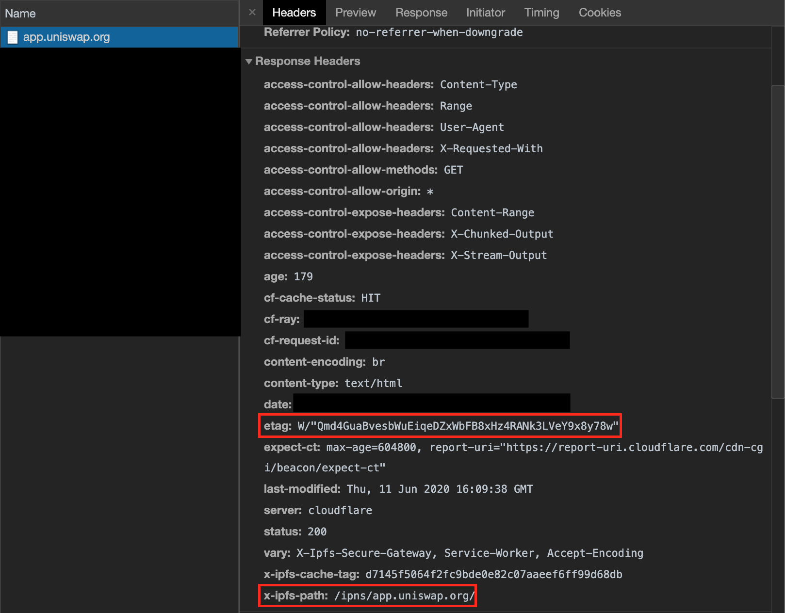

# TL;DR

- In an effort to continue decentralizing, we have created a mechanism for the community to host the Starswap Interface
- The open-source [Starswap Interface](https://github.com/Starswap/Starswap-interface) built by our team and
  community is [automatically deployed](https://github.com/Starswap/Starswap-interface/releases) daily to IPFS
- Community members can pin the IPFS hashes to ensure availability
- We use IPNS + DNSLink to point `/ipns/app.starswap.xyz` to the latest [IPFS release](https://github.com/Starswap/Starswap-interface/releases)
- [app.starswap.xyz](https://app.starswap.xyz) is now served exclusively from the latest
  [IPFS release](https://github.com/Starswap/Starswap-interface/releases), however any IPFS gateway can be used directly
- The URL [Starswap.exchange](https://Starswap.exchange) now forwards to [app.starswap.xyz](https://app.starswap.xyz)
- The ENS contenthash for `Starswap.eth` now points to the latest IPFS release allowing the URL [Starswap.eth.link](https://Starswap.eth.link/) to be used

## Interfaces and decentralization

The Starswap **protocol** is trustless and decentralized because it lives entirely on-chain.
Anyone running an Ethereum node can interact with the contracts directly which will perform as programmed for as long as Ethereum exists.
However, not everyone wants to run a node. Instead, many users choose to interact with Starswap through web interfaces,
trade aggregators, wallets, or other DAPPs that have integrated Starswap natively in their smart contracts.

When using an interface, users should verify the transactions they sign match the transaction presented by the interface.
However, it is not always easy to do this. This is why it is important to use reputable interfaces.
We're thrilled to see a growing ecosystem of high-quality interfaces for Starswap, including Argent, 1inch, Rainbow,
Paraswap, Zerion, Instadapp, and many more.

Open source interfaces (including many of the above) allow users to verify the code they are interacting with does what
it claims. If a user runs the code locally, they can make transactions with confidence. However, as soon as the code
is hosted, **it is difficult for users to verify the website they are interacting has not been modified**.

This is one of the problem that IPFS [aims to solve](https://blog.cloudflare.com/e2e-integrity/).

## What we did

Our team has always cared about decentralization, security, and accessibility. This is why we built an
[open-source interface](https://github.com/Starswap/Starswap-interface) for Starswap that the community can directly run,
verify and build upon. We’ve just taken another step forward by decentralizing the hosting of the Starswap Interface using IPFS.

Using [GitHub Actions](https://github.com/features/actions), the [Starswap Interface](https://github.com/Starswap/Starswap-interface)
is now deployed at least once per day to IPFS. Each release is automatically [pinned](https://docs.ipfs.io/concepts/persistence/)
using [pinata.cloud](https://pinata.cloud), a free IPFS pinning service.
The IPFS releases can be found [on GitHub](https://github.com/Starswap/Starswap-interface/releases).

This means the Starswap Interface can now be accessed via IPFS directly, through a gateway such as [cloudflare-ipfs.com](https://cloudflare-ipfs.com/ipns/app.starswap.xyz/), or by an _alias_ to the Cloudflare gateway at [app.starswap.xyz](https://app.starswap.xyz).

The domain Starswap.exchange is now redirected to app.starswap.xyz, which is an alias to the Cloudflare IPFS gateway that serves the Starswap Interface from IPFS.

## How we did it

The `app.starswap.xyz` subdomain is given a CNAME record pointing at `cloudflare-ipfs.com`.

When a user visits the domain `app.starswap.xyz`, the browser first looks up the DNS record and finds a CNAME to `cloudflare-ipfs.com`.
The server at `cloudflare-ipfs.com`, i.e. Cloudflare’s IPFS gateway, looks up the
[DNSLink record](https://docs.ipfs.io/concepts/dnslink/) for the subdomain.
That TXT record contains the IPFS hash of the latest release.

Cloudflare’s IPFS gateway then fetches the content using the IPFS protocol and serves the interface to your browser via HTTPS.

## Some changes

Because IPFS gateways will not default to serving `/index.html` as is expected by many single page applications, the Starswap Interface uses a "hash" based router.

This means that links that contain paths, such as [app.starswap.xyz/swap](https://app.starswap.xyz) will no longer work, but [app.starswap.xyz/#/pool](https://app.starswap.xyz/#/swap) will work.

## Security Unicorn

Some settings on the Starswap Interface use localstorage, which is shared across users in some IPFS gateways.

When using an IPFS gateway and referencing an IPFS hash or IPNS name by the _path_
(e.g. [cloudflare-ipfs.com/ipfs/QmdJApBwfsGua9v.../](https://cloudflare-ipfs.com/ipfs/QmdJApBwfsGua9vKnMbswGFGA4y5Kj2VNNPhvcsc8NC7iA/))
rather than the _subdomain_
(e.g. [bafybeig6hsm....cf-ipfs.com](https://bafybeig6hsm6lj74ertjf7hghsj2zrkzzpec5iyrt57vxiwxqltmgeeokm.cf-ipfs.com/)),
other sites accessed from the same IPFS gateway can view and change your settings in the Starswap Interface.

To avoid this possibility, you can use the subdomain format of IPFS gateway URLs, which are contained in
[every release](https://github.com/Starswap/Starswap-interface/releases) along with the path format.

## Verifying a build

You can check what build you are being served from Cloudflare's IPFS gateway by looking at your browser's network console for the response headers sent directly from Cloudflare's IPFS gateway.

Cloudflare's gateway uses the IPFS hash of the deployment in the `etag` header, and reports the resolved IPNS path in the `x-ipfs-path` header.

## How you can help

To keep the Starswap Interface available, you can pin the hash of the [latest release](https://github.com/Starswap/Starswap-interface/releases/latest).

If this sort of work sounds cool to you, we're hiring! [Shoot us a message!](mailto:contact@starswap.xyz)
